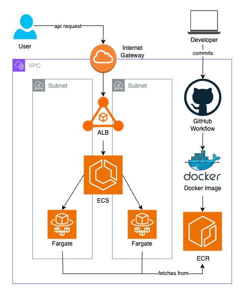

# 🎬 Video Stylizer API

A FastAPI-based microservice that allows users to upload videos, extract frames, apply stylization effects (grayscale, cartoon), and download the final processed output. Built for deployment using Docker and AWS ECS with full infrastructure provisioning via Terraform.

---

## 📁 Directory Overview

```text
video-stylizer/ 
├── app/                  # Core FastAPI app (routes, utils, styler, etc.)
├── data/                 # Automatically created structure for processing
│   ├── uploads/          # Uploaded videos
│   ├── frames/           # Extracted raw frames
│   ├── styled_frames/    # Stylized frames per style
│   └── styled_videos/    # Final processed video files
├── tests/                # Unit + integration test cases
├── Dockerfile            # Container definition
├── Makefile              # Simplified CLI commands
├── infra/            # Infrastructure-as-Code (VPC, ECS, ALB, etc.)
└── README.md             # This file
```

---

## 🎞️ Why is a sample video provided?

To simplify testing and reduce resource usage, a small sample video (`data/sample.mp4`) is provided. You can use the `/download_sample` endpoint to retrieve and test against this video, avoiding heavy loads during development or on limited Fargate resources.

---

## 📦 API Overview

| Method | Endpoint              | Description                                |
|--------|-----------------------|--------------------------------------------|
| POST   | `/upload_video`       | Upload a video                             |
| POST   | `/extract_frames`     | Extract frames from uploaded video         |
| POST   | `/style_frame`        | Stylize a single frame                     |
| POST   | `/style_frames`       | Stylize all frames                         |
| POST   | `/create_stylized_video` | Combine frames into a video              |
| GET    | `/download_video`     | Download the stylized video                |
| GET    | `/download_frame`     | Download a specific styled frame           |
| GET    | `/download_sample`    | Download sample video                      |
| DELETE | `/delete_video`       | Delete all files for a specific video ID   |
| DELETE | `/delete_all`         | Delete all uploaded/generated files        |
| GET    | `/list_uploads`       | List uploaded video filenames              |
| POST   | `/stylized_video`     | One-shot endpoint: upload → style → download |

---

## 🐳 Dockerfile Breakdown

- Base Image: Lightweight Python 3.11
- WORKDIR: All app files live in /app
- COPY: Includes everything in the container
- CMD: Runs FastAPI using uvicorn on port 8000

---

## ☁️ Infrastructure with Terraform

The project uses Terraform to deploy on AWS using the following architecture:
- VPC: Custom VPC with 2 public subnets for HA deployment
- Internet Gateway: Allows public traffic from users
- ALB (Application Load Balancer): Handles routing and health checks
- ECS Cluster: Runs containers using AWS Fargate
- Fargate Tasks: Scales containerized workloads automatically
- ECR (Elastic Container Registry): Stores and serves Docker images
- GitHub Actions CI/CD: Automates image build & pushes to ECR on new commits to prod



---

## 🚀 Deployment Workflow (CI/CD)

1.	Push to prod branch on GitHub
2.	GitHub Action builds Docker image
3.	Pushes to ECR with commit hash tag
4.	ECS Task Definition is updated with new image
5.	ECS Service redeploys only if image has changed (no force deployments)

---

## 🔐 Secrets (GitHub Actions)

You must set these repository secrets in GitHub:
- AWS_ACCESS_KEY_ID
- AWS_SECRET_ACCESS_KEY